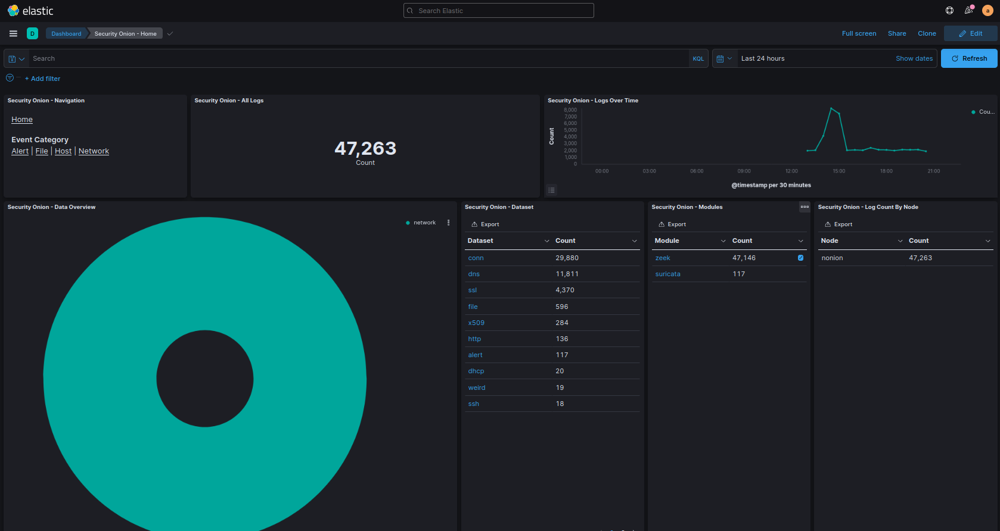
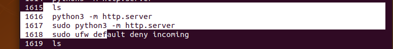
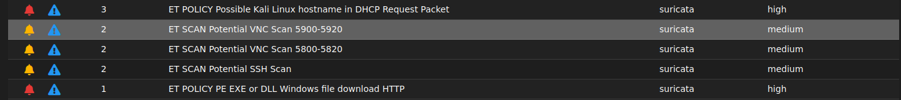
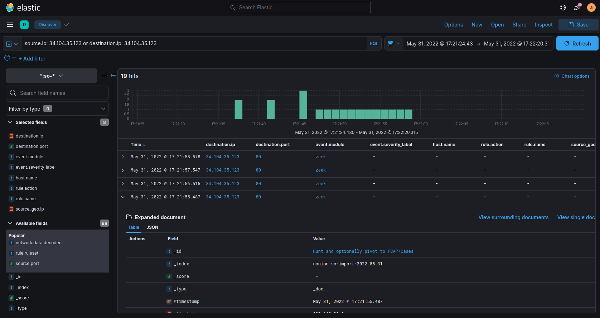

# Installing Security Onion

###### Importing & Forwarding 
Forwarding leaves Server visible on the network. 

| VMS | Gateway | HIDS  |
|--|--|--| 
|  2 |   10.0.1.14,15   |  2  |
|--|--|--| 

### HIDS & NIDS
A host-based connection by Natting it onto the computer such as your centos or Ubuntu Installation or you an NAT your installation and import within a NAT Network. 

#### Benifits of NAT
- Only Outbound Connections by Default
- Can't be accessed outside of the Network or the Host Computer
- Option to have packets forwarded to the Security Onion Server. 

Automation of transfering the files in VM's in Nat Network consist of: 
			- Opening a port and running so-allow. 
			
			- Transfer file from Host to HIDS by mounting media folder with read only access.
---

#### Security Onion Installation
This install will be Airgapped from the internet and automation will be created to open up times for importing the data. Forwarding is slightly less secure to start off. Importing doesn't require traditional network - having a NAT Network allows for forwarding to create a HIDS that has Indicators of Attack and not just Indicators of Compromise while still being airgapped from the public internet.

# Alerts 
Since I used the Import Module, .pcapng files can be recorded to baseline. Alerts would be IOC or Indicators of Compromise. I was doing testing but there is something suspiscious... 

> ET POLICY EXE or DLL Windows file download HTTP

Looks like something occurred that is outside me running Nmap & having Kali as the hostname. 

Google trying to download something over http. 

